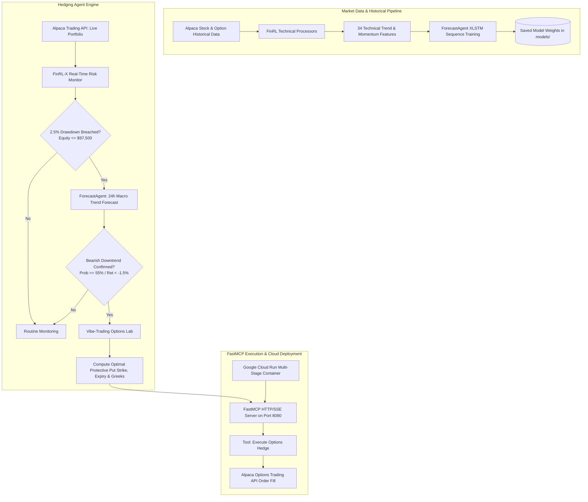

# Alpaca AI Portfolio Hedging System

[](https://lablab.ai/ai-hackathons/alpaca-ai-trading-agents-hackathon)
[](https://www.python.org/)
[](https://astral.sh/uv)
[](https://modelcontextprotocol.io/)
[](https://cloud.google.com/run)

An autonomous AI trading & portfolio hedging agent engineered to protect equity during macro market downturns in paper and live environments. Built for the **Alpaca AI Trading Agents Hackathon**.

---

## 🏛️ System Architecture



---

## 🌟 Key Capabilities

### 1. FinRL-X Real-Time Risk Monitoring
- Monitors live portfolio equity against the mandatory **$100,000** Alpaca paper trading starting capital.
- Enforces a hardcoded **2.5% Drawdown Risk Gate** (triggers when equity drops below **$97,500.00** / $2,500 drawdown).
- Emits real-time diagnostic risk evaluations (`SAFE`, `WARNING` at 1.8%, `BREACHED` at 2.5%).

### 2. Zero-Shot Intraday Downtrend Forecasting (ForecastAgent)
- **Diversified Cross-Asset Panel**: Ingests 2-year lookback hourly bars across a 9-ETF macroeconomic panel (`SPY`, `QQQ`, `IWM`, `XLK`, `XLF`, `XLE`, `XLV`, `GLD`, `TLT`) via Alpaca's Historical Data Clients.
- **FinRL & Relative Strength Feature Engineering**: Appends 22 standard FinRL indicators plus 8 cross-asset Relative Strength/Momentum features against the `SPY` benchmark (`rs_ratio_to_spy`, `rs_ratio_momentum`, `rs_excess_return_24h`, `sector_breakdown_flag`, `beta_to_spy_24h`), generating **42 features** per hourly step (32,886 total panel rows, 1.38M data points).
- **Leak-Free Panel Training**: Sequences sliding windows strictly within each individual asset's boundary (**27,090 training sequences**, **4,086 validation sequences**), mathematically preventing cross-ticker contamination and out-of-sample forward leakage.
- **Deep Sequence Architecture**: Trains a bi-directional recurrent temporal model with multi-quantile trajectory forecasting (10th, 50th, 90th percentiles) and macro downtrend probability classification.
- Compiled model artifacts saved to [`models/`](file:///c:/AI_Tools/alpaca-ai-trading-agents-hackathon/models/).

### 3. Vibe-Trading Options Lab Quantitative Hedging
- **Black-Scholes & Greeks Engine**: Analytical calculation of Delta ($\Delta$), Gamma ($\Gamma$), Vega ($\mathcal{V}$), Theta ($\Theta$), and Rho ($\rho$).
- **Optimal Protective Put Selector**:
  - Dynamically calculates the optimal strike (e.g. $-0.35$ Delta OTM put), expiry date (DTE), and required contracts ($N = \lceil \frac{\text{Equity}}{S \times 100} \rceil$).
  - Enforces a strict hedge budget ceiling ($\le 1.5\%$ of portfolio value).
  - Formats OCC option symbols (e.g. `SPY260918P00254000`) and computes breakevens, max loss, and downside coverage.

### 4. Local Reasoning & Multi-Step Orchestration
- Orchestrates multi-step chain-of-thought logic compatible with **Ollama** (`llama3.1`) and **OpenClaude**.
- Produces structured decision plans auditing risk status, forecast probabilities, and trade recommendations.

### 5. FastMCP Server & Cloud Run Ready
- Exposes structured MCP tools over **HTTP/SSE transport** for AI assistants (Claude Desktop, Cursor, Alpaca CLI).
- Multi-stage `Dockerfile` with `uv` virtual environment, non-root user security, and automated deployment scripts for **Google Cloud Run**.

---

## 📁 Repository Structure

```
alpaca-ai-trading-agents-hackathon/
├── Dockerfile                   # Multi-stage build for Google Cloud Run (uv builder + python:3.11-slim)
├── .dockerignore                # Excludes caches and heavy binaries
├── pyproject.toml               # Modern uv package & dependency configuration
├── uv.lock                      # Deterministic lockfile (100+ packages)
├── .env.example                 # Environment variable template
├── .env                         # Local configuration & Alpaca API credentials
├── README.md                    # System documentation
│
├── src/                         # Core Agent Application
│   ├── __init__.py
│   ├── agent/
│   │   ├── forecast_predictor.py # Real-time ForecastAgent inference engine
│   │   └── orchestration.py      # Multi-step reasoning loop (Ollama/OpenClaude)
│   ├── risk/
│   │   └── risk_monitor.py       # FinRL-X 2.5% drawdown gate evaluator
│   ├── options/
│   │   └── options_lab.py        # Vibe-Trading Options Lab & Greeks engine
│   ├── execution/
│   │   └── alpaca_trader.py      # Autonomous Alpaca Trading API client
│   └── mcp_server/
│       └── server.py             # FastMCP HTTP/SSE server & tool definitions
│
├── training/                    # Historical Data & Training Pipeline
│   ├── __init__.py
│   ├── download_hourly_data.py  # 2-year hourly stock & options downloader
│   ├── processors.py            # FinRL technical indicator processor
│   └── train_forecast_agent.py  # Deep sequence model training loop
│
├── models/                      # Compiled Model Artifacts
│   ├── forecast_agent_downtrend.pt # PyTorch model weights
│   ├── model_config.yaml           # Model hyperparameters & architecture
│   └── scaler_metadata.json        # Feature normalization parameters
│
├── scripts/                     # Cloud Deployment
│   ├── deploy_cloud_run.sh      # Bash script for Google Cloud Run deployment
│   └── deploy_cloud_run.ps1     # PowerShell script for Google Cloud Run deployment
│
├── tests/                       # Unit & Integration Tests
│   └── test_hedging_engine.py   # Test suite for risk gates, Greeks, & reasoning
│
├── ForecastAgent/               # ForecastAgent 1.0 SDK submodule
├── FinRL-Trading/               # FinRL-Trading strategies submodule
└── Vibe-Trading/                # Vibe-Trading quantitative library submodule
```

---

## ⚡ Quickstart & Installation

### 1. Prerequisites
- Python `>=3.11`
- [`uv`](https://github.com/astral-sh/uv) package manager (`curl -LsSf https://astral.sh/uv/install.sh | sh` or `winget install --id=astral-sh.uv`)

### 2. Environment Setup
```bash
# Install all dependencies and sync virtual environment
uv sync

# Copy environment template
cp .env.example .env
```

Ensure your `.env` contains your Alpaca Paper Trading credentials:
```ini
APCA_API_KEY_ID=your_alpaca_paper_key_id
APCA_API_SECRET_KEY=your_alpaca_paper_secret_key
APCA_API_BASE_URL=https://paper-api.alpaca.markets/v2
INITIAL_PORTFOLIO_EQUITY=100000.00
MAX_DRAWDOWN_THRESHOLD=0.025
HOST=0.0.0.0
PORT=8080
MCP_TRANSPORT=sse
```

---

## 🚀 Execution Guide

### 1. Run the Training Pipeline (Hourly Data)
```bash
# Download 2-year hourly bars, compute FinRL indicators, and train ForecastAgent
uv run python -m training.train_forecast_agent
```

### 2. Run the Test Suite
```bash
# Execute unit and integration tests
uv run python -m unittest tests.test_hedging_engine
```

### 3. Launch FastMCP Server (HTTP/SSE)
```bash
# Start the FastMCP server locally on port 8080
uv run python -m src.mcp_server.server
```

### 4. Interactive Alpaca CLI (`alpaca-hedge-cli`)
```bash
# Query live account status (supports --json for automation)
uv run python -m src.cli status
uv run python -m src.cli status --json

# Evaluate FinRL-X 2.5% drawdown risk gate against $100k starting capital
uv run python -m src.cli risk

# Run ForecastAgent 24h macro downtrend prediction on SPY
uv run python -m src.cli forecast --symbol SPY

# Calculate optimal protective put and Black-Scholes Greeks via Options Lab
uv run python -m src.cli hedge --symbol SPY --delta -0.35 --dte 21

# Run end-to-end autonomous reasoning cycle and place hedge order if triggered
uv run python -m src.cli cycle --symbol SPY --execute
```

### 5. Autonomous Live Monitoring Daemon
```bash
# Run continuous live monitoring and automated hedging daemon
uv run python scripts/run_live_agent.py --symbol SPY --interval 60

# Run single cycle dry-run simulation
uv run python scripts/run_live_agent.py --symbol SPY --once --dry-run
```

---

## 🛠️ FastMCP Tools Exposed

| Tool Name | Parameters | Description |
| :--- | :--- | :--- |
| `get_portfolio_status` | *None* | Queries live account equity, cash, buying power, and open positions from Alpaca. |
| `check_risk_gates` | `initial_balance`, `max_drawdown_pct` | Evaluates real-time drawdown against the 2.5% ($97,500 floor) gate. |
| `predict_macro_forecast` | `symbol` | Runs ForecastAgent zero-shot inference on hourly bars to predict 24h downtrend probability. |
| `calculate_protective_put` | `symbol`, `target_delta`, `dte_days`, `implied_volatility` | Computes optimal protective put strike, expiry, contracts, debit, and Greeks via Options Lab. |
| `run_autonomous_hedging_cycle` | `symbol`, `auto_execute` | Executes end-to-end reasoning cycle and autonomously places the hedge order if gates breach. |
| `execute_protective_put_order` | `option_symbol`, `contract_qty`, `limit_price` | Direct autonomous options order execution via Alpaca Trading API. |

---

## 🪶 Featherless AI Sponsor Integration

The reasoning orchestrator integrates **Featherless AI** (Hackathon Sponsor with Per-Request API, Code: `ALPACAA26`) for high-level risk supervisor synthesis:
```ini
FEATHERLESS_API_KEY=your_featherless_api_key
FEATHERLESS_BASE_URL=https://api.featherless.ai/v1
FEATHERLESS_MODEL=meta-llama/Meta-Llama-3.1-8B-Instruct
```

---

## 🏆 Hackathon Submission Deliverables

All official deliverables for the **Alpaca AI Trading Agents Hackathon** ($6K Prize Pool on LabLab.ai) are curated in [`submission/`](file:///c:/AI_Tools/alpaca-ai-trading-agents-hackathon/submission/):

| Deliverable | Description | File Link |
| :--- | :--- | :--- |
| **1-Page Write-Up** | Publication-grade writeup covering AI logic, risk gates, and Alpaca infrastructure. | [`HACKATHON_ONE_PAGE_WRITEUP.md`](file:///c:/AI_Tools/alpaca-ai-trading-agents-hackathon/submission/HACKATHON_ONE_PAGE_WRITEUP.md) |
| **Slide Presentation** | 10-slide visual presentation deck with architecture, formulas, and telemetry. | [`SLIDE_PRESENTATION.md`](file:///c:/AI_Tools/alpaca-ai-trading-agents-hackathon/submission/SLIDE_PRESENTATION.md) |
| **Video Presentation Script** | 3-minute turn-by-turn video presentation script with visual cues and demo points. | [`VIDEO_PRESENTATION_SCRIPT.md`](file:///c:/AI_Tools/alpaca-ai-trading-agents-hackathon/submission/VIDEO_PRESENTATION_SCRIPT.md) |
| **Submission Metadata** | Pre-formatted, character-counted copy for LabLab.ai submission portal. | [`SUBMISSION_METADATA.md`](file:///c:/AI_Tools/alpaca-ai-trading-agents-hackathon/submission/SUBMISSION_METADATA.md) |
| **Build-in-Public Posts** | 5 high-impact posts for X and LinkedIn tagging `@lablabai` and `@AlpacaHQ`. | [`social_media_posts.md`](file:///c:/AI_Tools/alpaca-ai-trading-agents-hackathon/submission/social_media_posts.md) |
| **Cover Banner** | 16:9 widescreen graphical banner asset for hackathon media tab. | [`cover_image.png`](file:///c:/AI_Tools/alpaca-ai-trading-agents-hackathon/submission/cover_image.png) |

---

## ☁️ Google Cloud Run Deployment

Deploy the containerized FastMCP server directly to Google Cloud Run:

```bash
# Linux / macOS / Cloud Shell
chmod +x scripts/deploy_cloud_run.sh
./scripts/deploy_cloud_run.sh

# Windows PowerShell
.\scripts\deploy_cloud_run.ps1
```

Or deploy manually via `gcloud`:
```bash
gcloud run deploy alpaca-hedging-agent \
    --source . \
    --platform managed \
    --region us-central1 \
    --port 8080 \
    --memory 2Gi \
    --cpu 2 \
    --min-instances 1 \
    --max-instances 5 \
    --no-cpu-throttling \
    --allow-unauthenticated \
    --set-env-vars "APCA_API_KEY_ID=...,APCA_API_SECRET_KEY=...,APCA_API_BASE_URL=https://paper-api.alpaca.markets/v2,INITIAL_PORTFOLIO_EQUITY=100000.0,MAX_DRAWDOWN_THRESHOLD=0.025"
```

---

## 🤖 Connecting to Claude Desktop / Cursor / Alpaca CLI

Add the server to your `claude_desktop_config.json` or Cursor MCP settings:

```json
{
  "mcpServers": {
    "alpaca-portfolio-hedging": {
      "command": "uv",
      "args": [
        "run",
        "--directory",
        "c:/AI_Tools/alpaca-ai-trading-agents-hackathon",
        "python",
        "-m",
        "src.mcp_server.server"
      ]
    }
  }
}
```

Or connect via the remote SSE URL on Google Cloud Run:
```json
{
  "mcpServers": {
    "alpaca-hedging-cloud": {
      "url": "https://alpaca-hedging-agent-<hash>-uc.a.run.app/sse"
    }
  }
}
```

---

## 📜 License & Compliance

Built for the **Alpaca AI Trading Agents Hackathon**. All live and paper trading operations comply with Alpaca API Terms of Service. Dedicated Paper Account ID: `ea533232-e5c5-4eee-87c9-b64cdf4c0c27` ($100,000.00 Starting Capital). Built with MIT / Apache 2.0 open-source dependencies.

